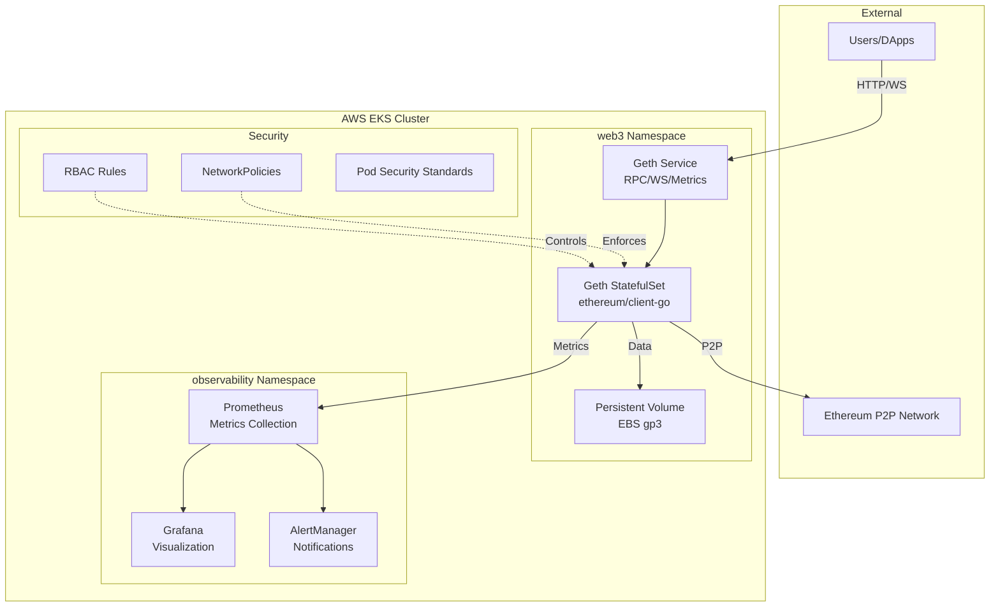
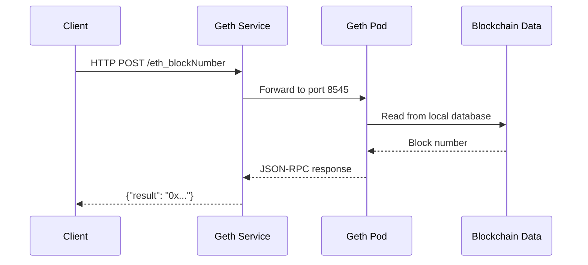
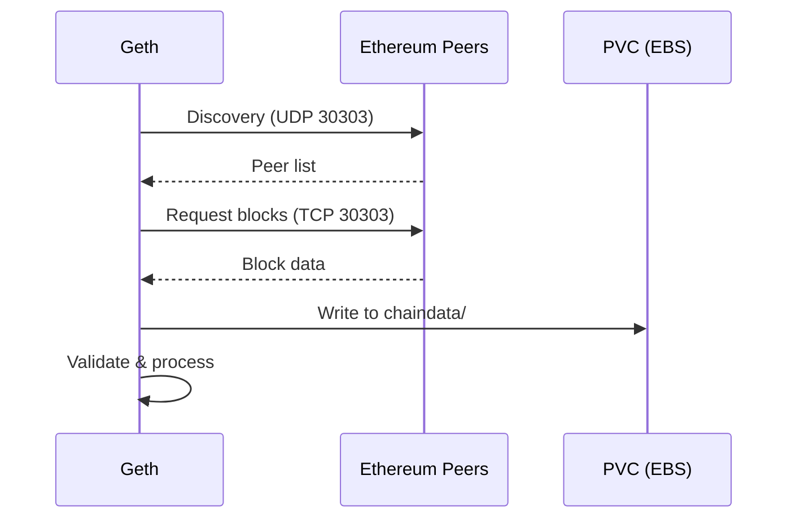
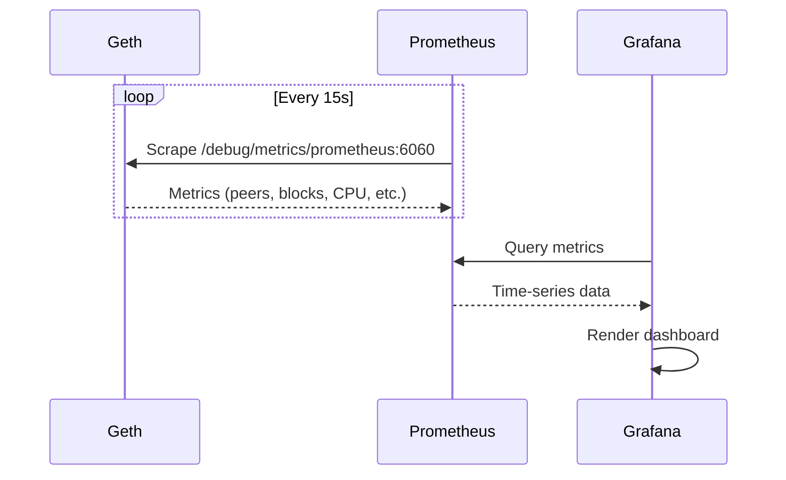

# Architecture Overview

## Table of Contents
- [System Architecture](#system-architecture)
- [Components](#components)
- [Data Flow](#data-flow)
- [Infrastructure](#infrastructure)
- [Security Model](#security-model)
- [Observability](#observability)

## System Architecture

The Web3 Node Platform is designed as a production-ready Ethereum node infrastructure running on Kubernetes with enterprise-grade observability and security.



## Components

### 1. Ethereum Node (Geth)

**Purpose:** Run a full Ethereum node for blockchain data access and transaction submission.

**Technology:** 
- Image: `ethereum/client-go:v1.14.11`
- Deployment: StatefulSet with persistent storage
- Networks: Mainnet, Sepolia, Holesky

**Key Features:**
- **Sync Modes:** Snap (fast), Full, Archive
- **APIs:** JSON-RPC (HTTP), WebSocket, GraphQL
- **Metrics:** Prometheus-compatible `/debug/metrics/prometheus`
- **High Availability:** PodDisruptionBudget, Anti-affinity rules

**Configuration:**
```yaml
Resources:
  - CPU: 1-4 cores (configurable via Kustomize)
  - Memory: 4-16 GB
  - Storage: 100GB (Sepolia) to 2TB+ (Mainnet Archive)
  
Ports:
  - 30303: P2P (TCP/UDP)
  - 8545: HTTP RPC
  - 8546: WebSocket RPC
  - 6060: Metrics
```

### 2. Observability Stack

#### Prometheus
- **Role:** Metrics collection and alerting
- **Scrapes:** Geth metrics, Kubernetes metrics, node metrics
- **Storage:** 30-day retention
- **Alerts:** Geth-specific rules (peer count, sync status, resource usage)

#### Grafana
- **Role:** Metrics visualization
- **Datasources:** Prometheus
- **Dashboards:** 
  - Geth Node Metrics (block height, peers, CPU/memory)
  - Kubernetes cluster metrics
  - Custom queries support

#### AlertManager (Optional)
- **Role:** Alert routing and notification
- **Integrations:** Slack, PagerDuty, Email

### 3. Infrastructure (AWS EKS)

**Control Plane:**
- Managed by AWS
- Version: 1.28+ (configurable)
- Logging: CloudWatch (API, audit, authenticator, controller, scheduler)

**Worker Nodes:**
- Instance Type: m5.2xlarge (8 vCPU, 32GB RAM) for production
- Disk: 100GB+ EBS gp3
- Autoscaling: 1-3 nodes (cluster-autoscaler)
- Taints: `blockchain-workload=true:NoSchedule` for dedicated nodes

**Networking:**
- VPC: /16 CIDR with public/private subnets across 3 AZs
- NAT Gateway: Single NAT for cost optimization (multi-NAT for HA)
- Security Groups: Restricted ingress/egress
- NetworkPolicies: Pod-level traffic control

**Storage:**
- StorageClass: `gp3` (AWS EBS)
- VolumeClaimTemplate: Dynamic provisioning
- Backup: Velero with S3 snapshots

## Data Flow

### RPC Request Flow


### P2P Sync Flow


### Metrics Collection Flow


## Infrastructure

### Kubernetes Resources

**Workloads:**
- `StatefulSet/geth`: Main Ethereum node
- `Deployment/prometheus`: Metrics collection
- `Deployment/grafana`: Visualization

**Services:**
- `Service/geth`: ClusterIP for RPC/WS access
- `Service/geth-headless`: StatefulSet DNS
- `Service/prometheus`: Prometheus UI
- `Service/grafana`: Grafana UI

**Storage:**
- `PersistentVolumeClaim/data-geth-*`: Blockchain data storage

**Configuration:**
- `ConfigMap/geth-config`: Environment variables
- `ConfigMap/prometheus-config`: Prometheus configuration
- `ConfigMap/prometheus-rules`: Alert rules
- `ConfigMap/grafana-datasources`: Grafana datasource config
- `ConfigMap/grafana-dashboards`: Dashboard definitions

**Security:**
- `ServiceAccount/geth`, `ServiceAccount/prometheus`
- `Role/geth`, `ClusterRole/prometheus`
- `RoleBinding`, `ClusterRoleBinding`
- `NetworkPolicy/geth-network-policy`
- `PodDisruptionBudget/geth-pdb`

### Terraform Modules

**Structure:**
```
terraform/eks/
├── main.tf               # Provider, backend config
├── locals.tf             # Computed values
├── variables.tf          # Input variables
├── outputs.tf            # Output values
├── provider.tf           # AWS provider
├── vpc.tf                # VPC, subnets, NAT
├── eks.tf                # EKS cluster, node groups
├── storage.tf            # StorageClasses, EBS CSI
├── velero.tf             # Backup infrastructure
└── envs/
    ├── dev.tfvars        # Development config
    └── prod.tfvars       # Production config
```

## Security Model

### Defense in Depth

**1. Network Level:**
- VPC isolation with private subnets
- Security Groups: Whitelisted ports only
- NetworkPolicies: Pod-to-pod traffic control
- NAT Gateway for outbound traffic

**2. Pod Level:**
- `runAsNonRoot: true`
- `allowPrivilegeEscalation: false`
- `readOnlyRootFilesystem: true` (where possible)
- Capabilities: Drop ALL, add only NET_BIND_SERVICE
- Seccomp: RuntimeDefault profile

**3. Access Control:**
- RBAC: Minimal required permissions
- ServiceAccounts: Dedicated per workload
- No default service account usage

**4. Secrets Management (Future):**
- AWS Secrets Manager integration
- external-secrets operator
- No hardcoded credentials

**5. Supply Chain Security:**
- Container image scanning (Trivy in CI)
- Signed container images (planned)
- Verified Geth releases

## Observability

### Metrics

**Geth Metrics (Prometheus):**
- `p2p_peers`: Connected peer count
- `eth_blockchain_height`: Current block number
- `eth_sync_height`: Sync progress
- `txpool_pending`: Pending transactions
- `system_cpu_sysload`: CPU usage
- `system_memory_allocs`: Memory allocations

**Kubernetes Metrics:**
- `container_cpu_usage_seconds_total`
- `container_memory_working_set_bytes`
- `kube_pod_status_phase`
- `node_filesystem_avail_bytes`

### Alerts

**Critical:**
- Geth node down (5+ minutes)
- Disk space < 15%
- High memory usage (> 85% for 10 minutes)

**Warning:**
- Low peer count (< 5 peers for 15 minutes)
- Sync lagging (> 100 blocks behind)
- High CPU usage (> 80% for 10 minutes)

### Logging

**Geth Logs:**
- Stdout/stderr captured by Kubernetes
- Log level: Configurable (info, debug, trace)
- Access: `kubectl logs -n web3 geth-0`

**Centralized Logging (Optional):**
- Loki for log aggregation
- Promtail for log shipping
- Grafana for log querying

## Performance Considerations

### Sync Times

| Network | Sync Mode | Storage | Approx. Time |
|---------|-----------|---------|--------------|
| Sepolia | Snap | 100GB | 2-4 hours |
| Mainnet | Snap | 1TB | 12-24 hours |
| Mainnet | Full | 1.5TB | 3-7 days |
| Mainnet | Archive | 12TB+ | 2-4 weeks |

### Resource Requirements

**Development (Sepolia):**
- CPU: 2 cores
- RAM: 4-8 GB
- Disk: 100-200 GB
- Cost: ~$50-100/month

**Production (Mainnet Snap):**
- CPU: 4-8 cores
- RAM: 16-32 GB
- Disk: 1-2 TB
- Cost: ~$300-500/month

**Archive Node (Mainnet):**
- CPU: 8+ cores
- RAM: 32-64 GB
- Disk: 12-16 TB
- Cost: $1000+/month

## Scalability

### Horizontal Scaling
- Multiple Geth replicas for read load distribution
- Load balancer for RPC requests
- Shared read-only storage (future enhancement)

### Vertical Scaling
- Kustomize overlays for environment-specific resources
- Cluster Autoscaler for dynamic node scaling
- HPA for stateless components (Prometheus, Grafana)

## Disaster Recovery

**Backup Strategy:**
- Velero: Full cluster backup (manifests, PVCs)
- EBS Snapshots: Point-in-time storage backup
- Retention: 7 days (configurable)

**Recovery Procedures:**
1. Restore from Velero backup (fastest)
2. Restore from EBS snapshot + redeploy
3. Fresh sync from network (slowest, most reliable)

**RTO/RPO:**
- Recovery Time Objective: < 4 hours
- Recovery Point Objective: < 24 hours

## Future Enhancements

1. **GitOps:** ArgoCD for declarative deployments
2. **Service Mesh:** Istio for advanced traffic management
3. **Multi-region:** Cross-region replication for HA
4. **Stateless RPC:** Separate RPC layer from sync nodes
5. **MEV Protection:** Flashbots integration
6. **Layer 2:** Support for Optimism, Arbitrum nodes
