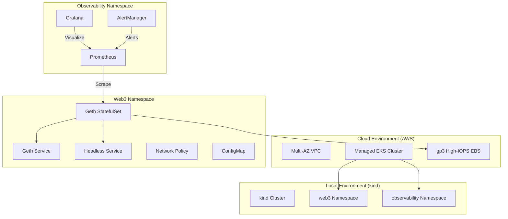

# Architecture Documentation

This project implements a highly available and monitorable Ethereum node platform on Kubernetes.

## 🏗️ High-Level Design

The system is designed with a clear separation of concerns, infrastructure automation, and deep observability.

## 📦 Key Components

### 1. Ethereum Node (Geth)
- **Deployment**: `StatefulSet` ensures stable network identifiers and persistent storage links.
- **Sync Mode**: Support for `snap`, `full`, and `light` sync.
- **Security**: Hardened via non-root user (1000), read-only root filesystems (where possible), and dropped capabilities.

### 2. Networking
- **StatefulSet Service**: Headless service for P2P discovery.
- **API Service**: ClusterIP service for HTTP-RPC, WebSocket, and Metrics access.
- **Isolation**: `NetworkPolicy` restricts traffic to required ports (30303, 8545, 8546, 6060).

### 3. Storage
- **Local**: `standard` storage class (local-path on kind).
- **AWS**: `gp3` optimized for 16,000 IOPS and 1,000 MiB/s throughput.

### 4. CI/CD Operations
- **Validation**: `kubeconform` and `kubectl` dry-runs.
- **Security**: `Trivy` scanning for manifests and images.
- **Automation**: `GitHub Actions` for multi-stage deployment.

## 🔒 Security Architecture

- **Isolation**: Workloads run in dedicated namespaces.
- **Least Privilege**: RBAC and IAM Roles for Service Accounts (IRSA on AWS).
- **EKS Hardening**: Nodes are tainted to ensure only blockchain workloads run on high-performance nodes.

## 🚀 Scalability

- **Horizontal**: Scalable via `REPLICAS` in `Makefile`.
- **Vertical**: Resource limits configurable via environment variables or Makefile.
- **Infrastructure**: AWS EKS Managed Node Groups provide automated scaling and patching.
